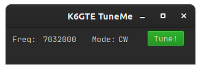

# Tuner
    

## What is it. Why is it...

This is a scratch my own itch project. I use [potato](https://github.com/mbridak/potato) for [POTA](https://pota.app/#/) hunting, and [sotacracker](https://github.com/mbridak/sotacracker) for chasing [SOTA](https://www.sota.org.uk/).
So when I click on an activation in one of those apps, my radio will be changed to the new band/mode, and on the spotted frequency using [rigctld](https://manpages.ubuntu.com/manpages/precise/man8/rigctld.8.html). 

One does not want to tune up on top of an activator. So, I made this little app. What it does is, when you press the tune button, it remembers what frequency and mode you are currently on. Then it tunes the radio away to a fairly safe frequency, away from the activator. Which, just coincidentally, happens to be the start of the FT8 window for that band:fire:. No one uses that anyways...
Switches your mode to CW, so you can key down to initiate a tune cycle, or press the tune button on your rig/tuner.
Once the tune cycle is complete, you press the tune button again, and the radio is changed back to the original activation frequency and mode you started on:beers:.

## Running from source

Install Python 3, then two required libraries.

If you're the Ubuntu/Debian type you can:

`sudo apt install python3-pyqt5 python3-requests`

You can install libraries via pip:

`python3 -m pip3 install -r requirements.txt`

Just make tuner.py executable and run it within the same folder, or type:

`python3 tuner.py`

## Building a binary executable

I've included a .spec file in case you wished to create your own binary from the source. To use it, first install pyinstaller.

`python3 -m pip3 install pyinstaller`

Then build the binary.

`pyinstaller -F tuner.spec`

Look in the newly created dist directory to find your binary.
